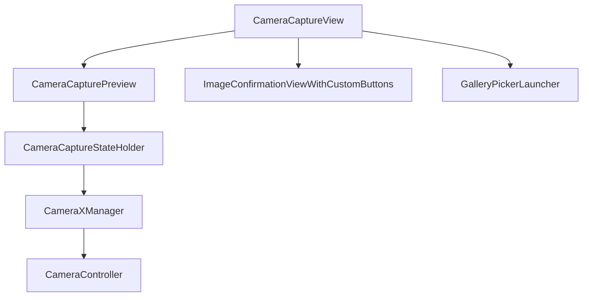

This document is also available in English: [ARCHITECTURE.md](docs/ARCHITECTURE.md)

# Guía de Arquitectura - ImagePickerKMP

## Introducción

Esta guía describe la arquitectura interna de la librería ImagePickerKMP, enfocándose en la separación entre la lógica de cámara y la UI, el uso del patrón StateHolder y las mejores prácticas para extensión y testeo.

---

## Principios de la arquitectura

- **Desacoplamiento total entre lógica y UI**: La lógica de cámara (inicialización, captura, cambio de cámara, flash, etc.) está separada de los componentes de UI Compose.
- **Patrón StateHolder**: Toda la lógica y el estado de cámara se gestionan en una clase StateHolder, que expone estados observables y funciones para disparar acciones.
- **UI reactiva y declarativa**: Los componentes Compose solo observan el estado y disparan eventos, sin lógica interna de cámara.
- **Extensible y testeable**: La lógica puede testearse y extenderse sin modificar la UI.

---

## Diagrama de flujo de componentes



---

## Patrón StateHolder

La clase `CameraCaptureStateHolder` es responsable de:
- Mantener el estado observable: modo de flash, loading, overlay de flash, etc.
- Exponer funciones: iniciar/detener cámara, alternar flash, capturar foto, cambiar cámara.
- Comunicar resultados y errores a la UI mediante callbacks.

### Ejemplo de integración

```kotlin
val previewView = remember { PreviewView(context) }
val coroutineScope = rememberCoroutineScope()
val stateHolder = remember { CameraCaptureStateHolder(context, cameraManager, previewView, preference, coroutineScope) }

LaunchedEffect(Unit) {
    stateHolder.startCamera(onError)
}

if (stateHolder.isLoading) { /* Mostrar loader */ }
Button(onClick = { stateHolder.capturePhoto(onPhotoResult, onError) })
```

---

## Flujo general de captura

1. **Permisos**: Se solicita permiso de cámara antes de mostrar la UI.
2. **UI de cámara**: Se muestra la preview y controles (flash, captura, cambio de cámara, galería).
3. **Captura**: Al capturar, se muestra un overlay de flash y se procesa la imagen.
4. **Confirmación**: Se muestra la pantalla de confirmación para aceptar o repetir.
5. **Galería**: Si está habilitado, se puede seleccionar desde la galería.

---

## Buenas prácticas

- **No mezclar lógica de cámara en la UI**: Usa siempre el StateHolder para manejar acciones y estado.
- **Personalización**: Usa los parámetros de los Composables para personalizar colores, iconos y layout.
- **Testeo**: Puedes testear la lógica de cámara instanciando el StateHolder en tests unitarios.
- **Extensión**: Para añadir nuevos controles o métricas, extiende el StateHolder y la UI de forma desacoplada.

---

## Referencias

- [README.es.md](docs/./README.es.md)
- [API_REFERENCE.es.md](docs/./API_REFERENCE.es.md)

---

¿Dudas o sugerencias? Abre un issue o consulta la documentación oficial. 